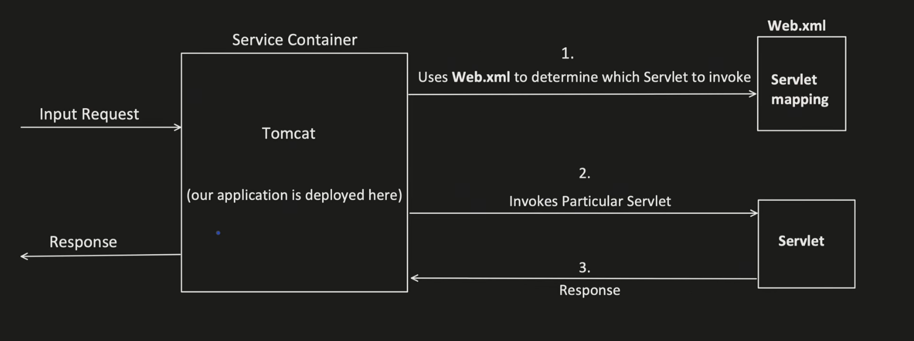
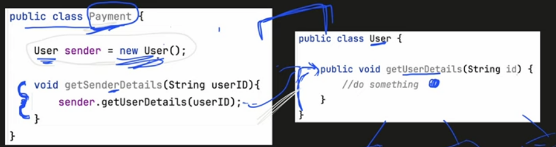
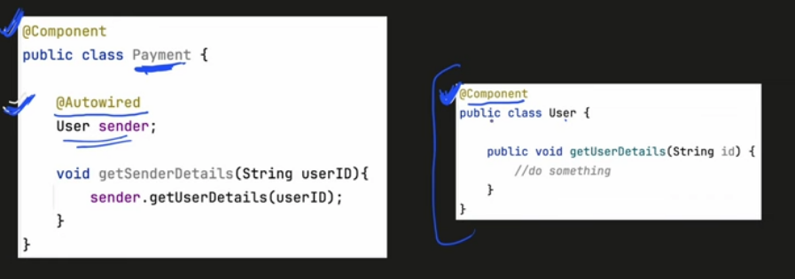
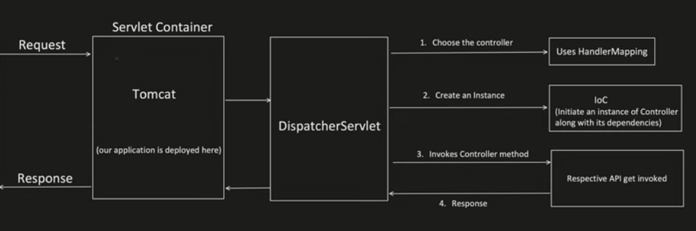

# Introduction
## Servlet
- Provides foundation for web applications
- Servlet is a class that handles client request and gives a response
- Servlet container are the ones which manages the servlets

### Sample Servlet

### Sample Web.xml

## Advantages of Spring framework
1. Removal of Web.xml
    - this file becomes too big over time and becomes difficult to manage
    - Spring introduces Annotations based configuration
2. Inversion of Control (IoC)
   - IoC is more flexible way to manage object dependencies and its lifecycle (Through dependency injection)
   - Helps in writing good ut cases as we can inject mock objects when we @Autowired dependencies.
   - Classic behavior: 
   - IoC behavior: 
3. Unit testing is much harder
   - As the object creation depends on servlet, mocking is not easy. Which makes Unit testing process harder
   - Spring dependency injection facility makes the Unit testing very easy.

   - 