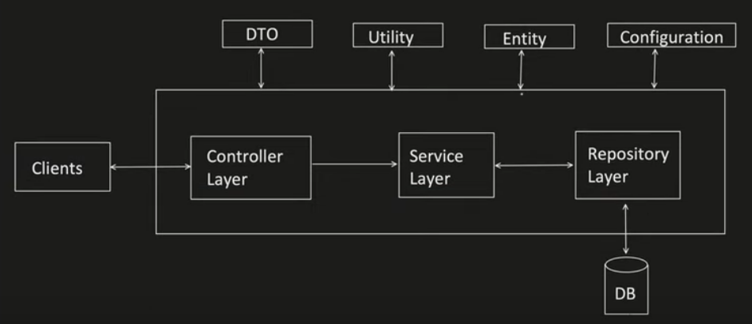

# Setting up Spring project and Layered architecture

https://start.spring.io

setup the project as a maven or a gradle project and the start that is it.

The example project is in `learningspringboot` project in this repo

## Layered architecture

1. DTO: Data transfer object is a object that maps the request or the response to this object. The service layer would map what the DB returns with the DTO and then gives it back to the controller to return.
2. Utility: Logic that is common across multiple `@Service`s will be placed in the utility classes.
3. Entity: Holds the POJOs `@Entity` which have the data columns and the getters and setters.
   - For insertions into the DB or retrievals from the DB the `@Service` layer would use `@Entity` to send and get data.
4. Configuration: This holds the application configuration. In spring boot we have an `application.properties` file.
