# Dependency Injection

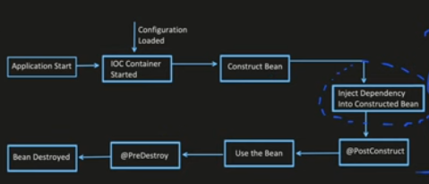

Consider the following code:
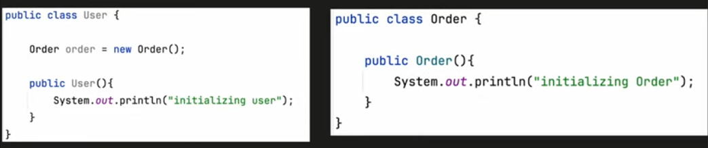

- The issue with this there is a tight coupling of `User` and `Order`.
- Any change in Order class (like changing order to an interface adn then creating many concrete classes), will affect the User class
- This rbeaks the **Dependency Inversion** rule of SOLI**D**. This states that DO NOT depend on concrete implementation, rather than depend on abstraction.
    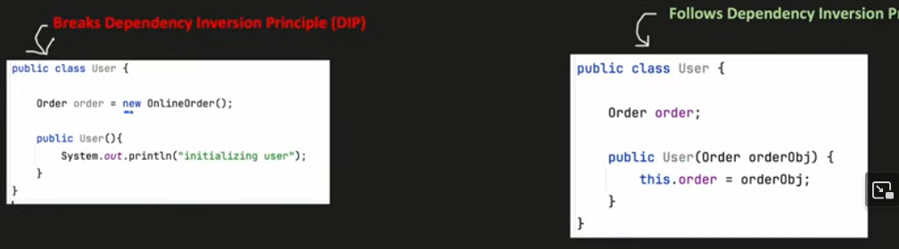
- In spring boot Dependency Inversion is achieved with Dependency Injection.
  - Using DI, we can make out class independent of its dependencies
  - It helps to remove the dep on concrete implentation and inject the deps from external source.
    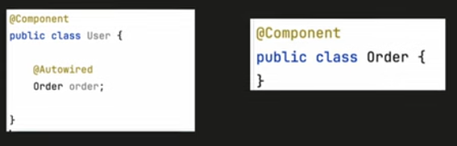
  - `@Autowired`, will first look for a bean of the required type. If bean is found, it will be injected
  - There are different ways of injection of deps:
    - **Field Injection:**
      - Deps is set into the fields of the class directly
      - Spring uses reflection, it iterates over the fields and resolve the deps.
        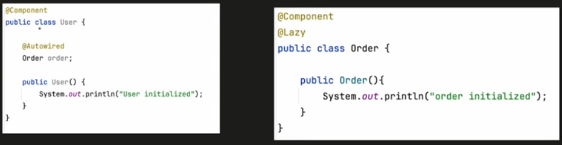
      - Advantage: Very simple and easy to use
      - Disadvantage: 
        - Cannot be used with immutable fields. Autowired params cannot be `final`.
        - Chance of NPE since a new User will have order as null
        - No way to mock the order object by default. (We use `@InjectMock`)
    - **Setter Injection:**
      - Deps are set into the field using `@Autowired` setter methods.
        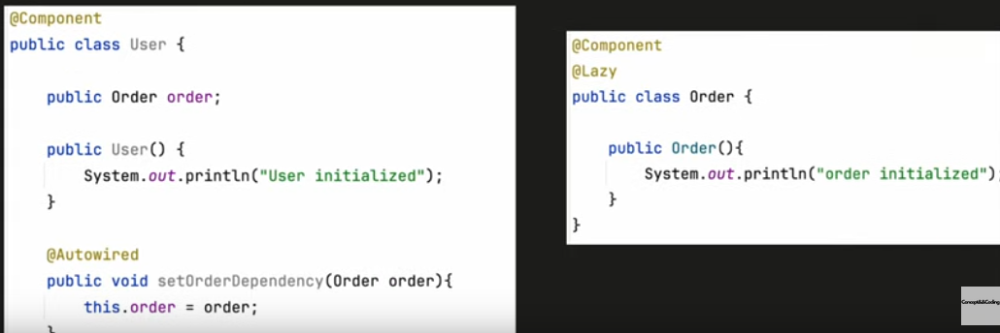
      - Advantage:
        - Deps can be changed anytime after the object is created (as object cannot be final)
        - Ease of testing. We can pass mock objects in the deps easily
      - Disadvantage:
        - Deps cannot be immutable/final
    - **Constructor Injection:**
      - Deps get resolved at the time of initialization of the object itself. We use an `@Autowired` constructor with the deps in param.
        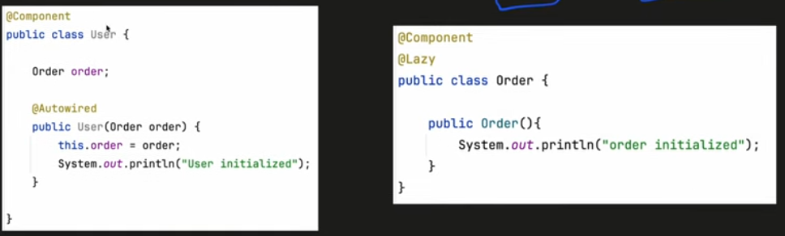
      - Spring boot resolves all the params of the constructor.
      - In spring boot 4.3 onwards we do not even need to use `@Autowired` if we have only one constructor. (Note if multiple exist without annotation then spring throws `BeanInstantiationException`).
      - Advantages:
        - All mandatory deps are created at the time of initialization, so no NPE and unnecessary null chekcs can be avoided
        - We can create immutable/final object using constructor injection.
        - At compile time itself we are certain if any dep is missing. Failfast.
        - Mock objects can be injected in UTs
          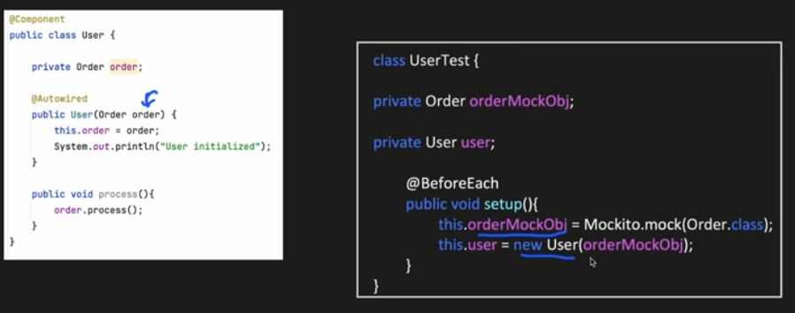

## Common issues with dep injection
### Circular deps
This can be solved with the following:
1. Remove common code that is there in the two classes to other class as a utility
2. Using `@Lazy` annotation to make sure that the cycle dep is not triggered. Here the order object is not initialized.
   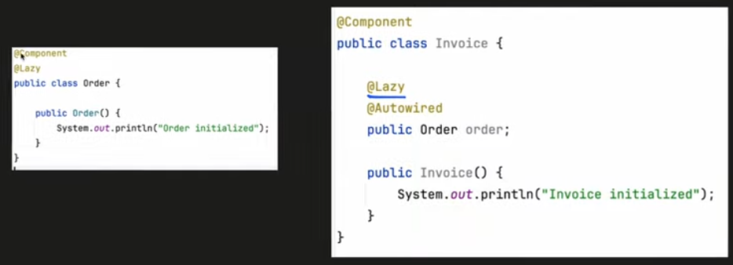
3. Using `@PostConstruct`. Here we use this annotation to make sure the invoice dep is resolved after order is constructed in the life cycle.
   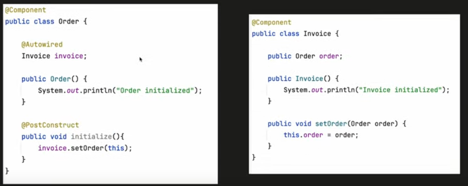

### Unsatisfied deps
Problem:

Here spring is not aware on which implementation of order it needs to take, and application will fail to start with `UnsatisfiedDependencyException: Error creating bean with name 'User'`

The following are the solutions:
1. Using `@Primary` annotation. We can mark one of the implememtation as primary making spring take only that as Autowirable.
   
2. Using `@Qualifier` annotation. We can give a custom name for each implementation with this annotation and specify the qualifier in the User class to make sure spring takes the right implementation.
   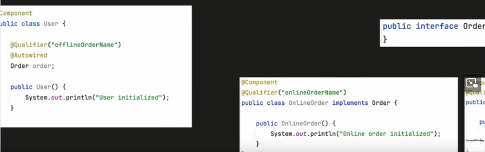

Notice that this break dep inversion in SOLID. To make it dynamic there are two approaches:
1. We create both objects and use some flag at runtime to determine which implementation to take:
   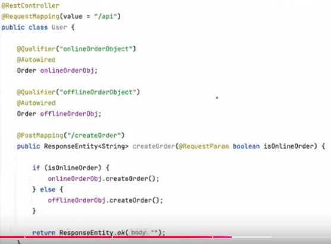
2. Or we can use `@Value` to determine at runtime what value to take in a `@Configuration` bean:
   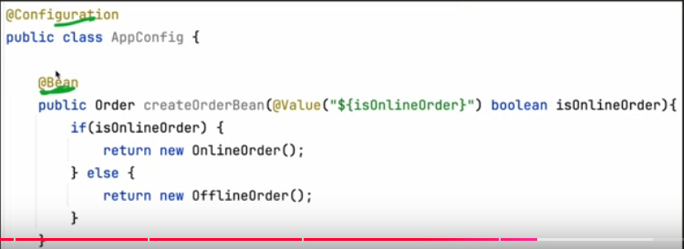
   
