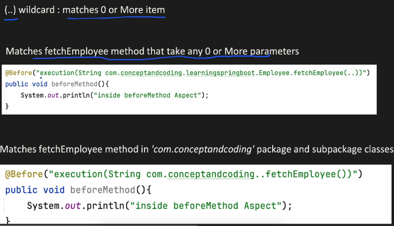

# AOP Aspect Oriented Programming

- It helps to intercept the method invocation, such that we can perform some task before and after the method
- AOP allow us to handle only business logic and forget about boilerplate a repetetive code like logging and transaction management

to this we need to add the following deps in `pom.xml`:
```xml
<dependency>
    <groupId>org.springframework.boot</groupId>
    <artifactId>spring-boot-starter-app</artifactId>
</dependency>
```

Now consider the following controller:


and the following `@Aspect` class:


When we call the get api end point, AOP makes sure that the pointcut expression is matched and if matched it will run the advice. So in our case it will print "inside beforeMethod Aspect" before the api method (fetchEmployee()) is executed.

## Pointcut:
It's an expression which tells where an advice should be applied.
### Types of pointcut expressions:
#### Execution
This matches a particular method in a particular class with wildcards.





#### Within
Matches all method withing any class or package


#### @annotation


#### Args
matches any method with particular arguments/params
