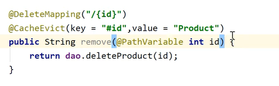

# Redis Caching

> There are several caching strategies. LRU is the industry standard. We have new strats like SIEVE (Marking nodes visited adn then during eviction mark the nodes unvisited sequentially till first unvisited node is reached to evict that)

Consider a DAO which uses redis as a DB to save items in them:

## @EnableCaching

First we add the `@EnableCaching` to the class (Controller/Service) where caching needs to be done. 

## @Cacheable
we will now add the `@Cacheable` annotation to the method where we will get from cache. The first call will go to DB and the subsequent calls will use the cache.

we can also specify conditions to follow when we decide to cache something. using `unless` pr `condition`.

## @CachePut

## @CacheEvict

This makes sure that the item is deleted from cache when the method executes

We can also specify beforeInvocation flag to determine if the eviction happens before or after the method execution.

