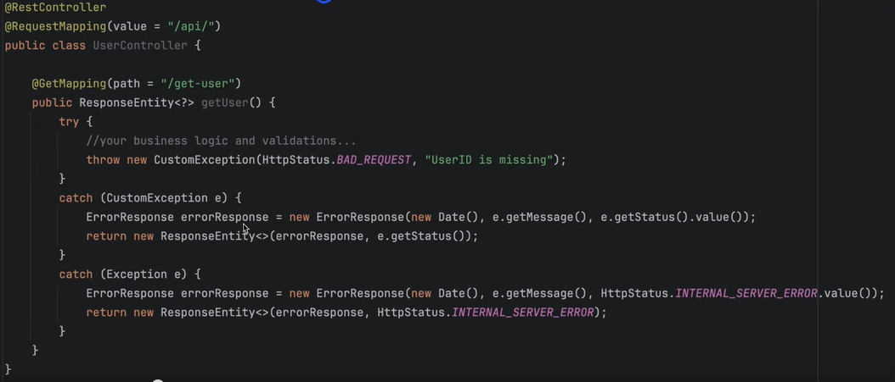

# Exception Handling

(1) (2) and (3) are happened in sequence by the HandlerExceptionResolverComposite (4).

We can get manual control over the exception being thrown by creating custom ResponseEntities:

## Using @ExceptionHandler

### Multiple handlers handling exceptions

### Multiple exceptions in same handler

