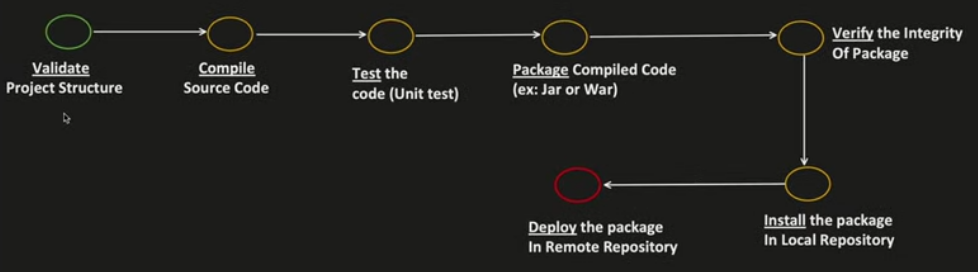

# Maven
- It is a project management tool
  - Build generation
  - dependency resolution
  - documentation etc
- Maven uses POM (Project Object Model) to achieve this.
- Maven commands looks for `pom.xml` file in the current directory and get the needed configuration.

## Maven Build Life Cycle

- `mvn pakage` stage will compile and put it in target directory
- `mvn install` phase will put it in the local `.m2` repo
- `mvn deploy` puts the jar files into the remote repository (Either the company repo or central pom) and the credentials for the same will be in the `settings.xml`

### Adding a task to one of the phases

