# Annotations

## Controller annotations
1. `@Controller`: Makes sure that the given class is part of the HTTP request
2. `@ResponseBody`: Makes sure that the method returns a HTTP response
3. `@RestController`: it is `@Controller` + `@ResponseBody`
   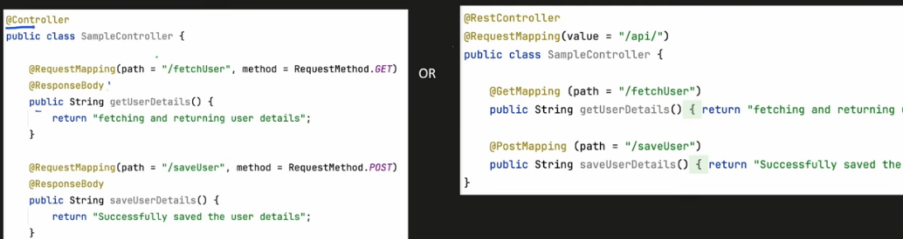
4. `@RequestParam`: used to bind the path params to the controller method
   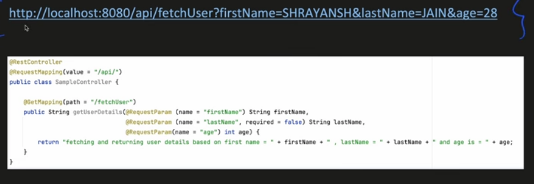
   - Primitive type casting
   - Wrapper classes type casting
   - String casting
   - Enums
   - Custom object types using a registered property editor
   - 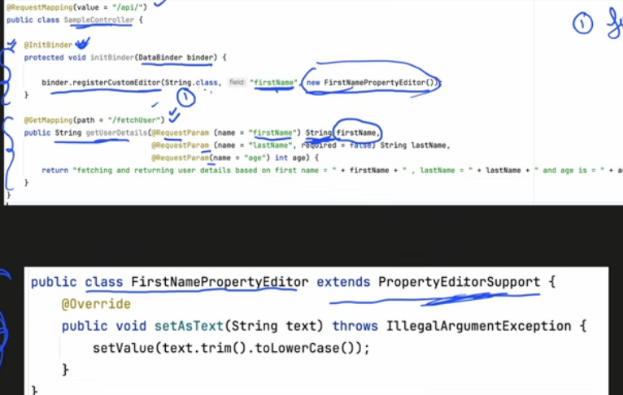
5. `@PathVariable`: This annotation is to map a path variable in the api path like `url/{PATH_VARIABLE}`
6. `@RequestBody`: This annotation is to map the request body to a DTO. Spring Boot uses GSON/Jackson
   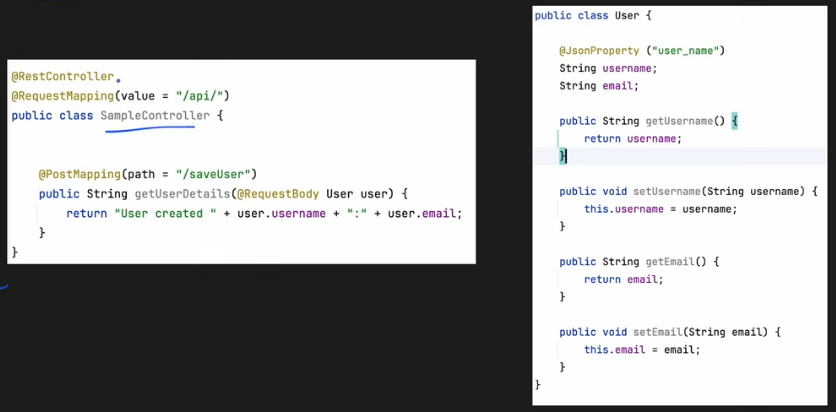
7. `ResponseEntity`: It represents the entire HTTP response. We can select the status code and then the JSON.
   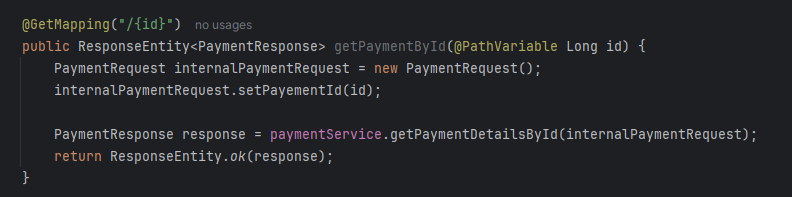
   - `@Controller`Here we need to internally create a @ResponseBody else it will be returning the actual datatype and not HTTP response. wheras in `@RestController` it will wrap the output as `ResponseEntity`.

## Other annotations
### `@ConditionalOnProperty`
Bean is created conditionally based on some flag. Consider the following case:
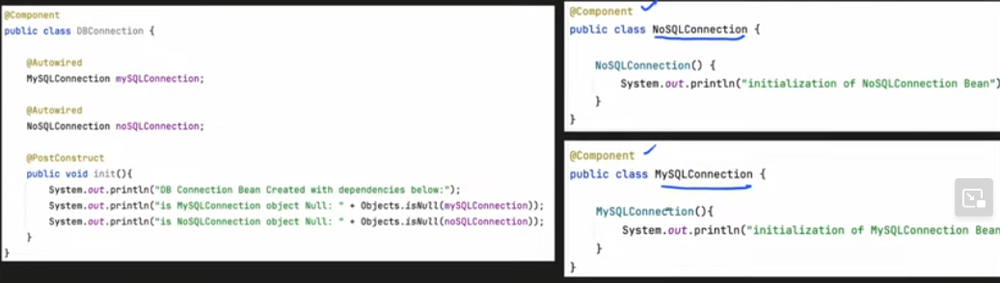

Now consider two use cases:
1. If we have a requirement to create only one of the two beans (In case company decides to migrate from sql to nosql)
2. If some part of code uses NoSql and some uses Sql, then it is better to chose at runtime which connection bean needs to be created.

To implement these use cases we first implement the components as follows:
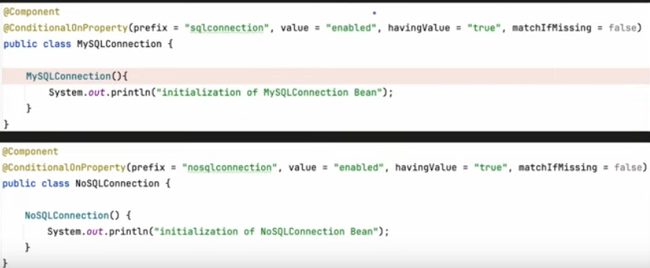

We then use the key in app props file to determine what your app needs:
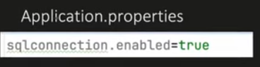

Now in the common code we can implement it like this:
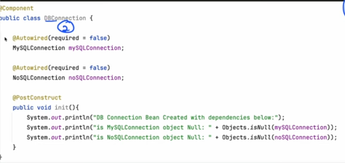

#### Advantages
1. Feature toggling is introduced
2. Avoid cluttered application context with uneeded beans
3. Save memory
4. Reduce start up time

#### Disadvantages
1. Misconfiguration can happen
2. Code complexity increases when over used across many classes. Needs to be used with caution.

---

### `@Profile`

Consider the following use case:
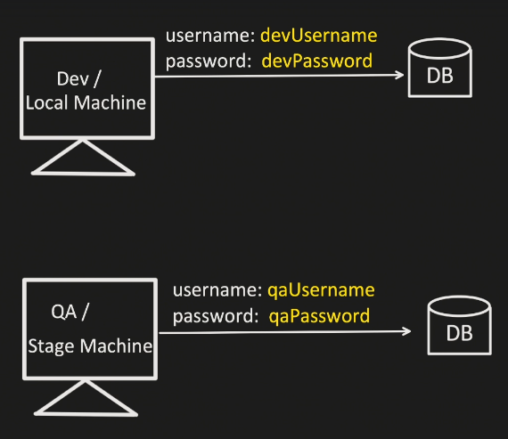
Here we see there is a need for environment separation for dev, qa, prod etc. since there could be different creds

depending on the environment we might have to have different props like:
- url and port
- connection timeout values
- request timeout values
- throttle values
- retry values

now we can have multiple application props for each environment type:
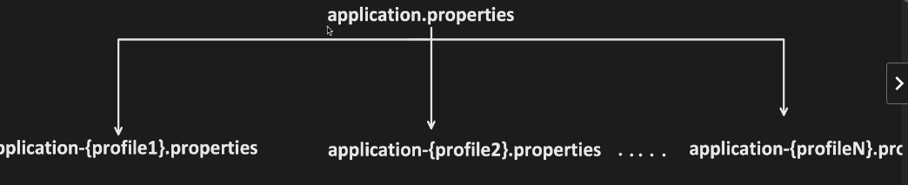

To let spring know what profile to use, we can specify the profile using `spring.profiles.active` prop.
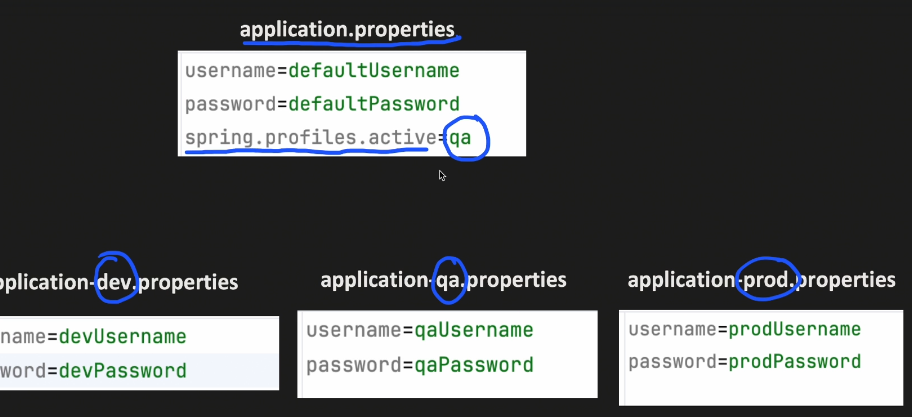

this creates a parent child relationship. if value is in profile file then that overrides the parent else it takes the parent value

if you want to setup the profile at runtime we can provide the profile in the command line:

```bash
mvn spring-boot:run -Dspring-boot.run.profiles=<PROFILE>
```

or we can set the profile in the `pom.xml` file like so:
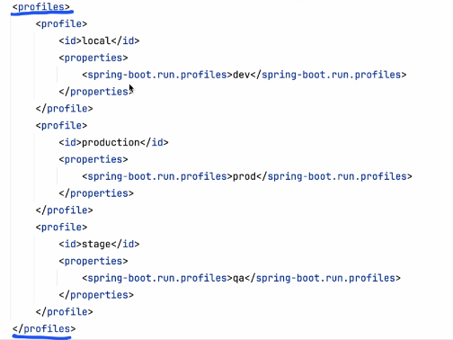

and run the command:
```bash
mvn spring-boot:run -P<profile_id>
```

Now where does the annotation come into play here?
The annotation is used to specify spring what bean to load based on this annotation. Imagine the following two beans:
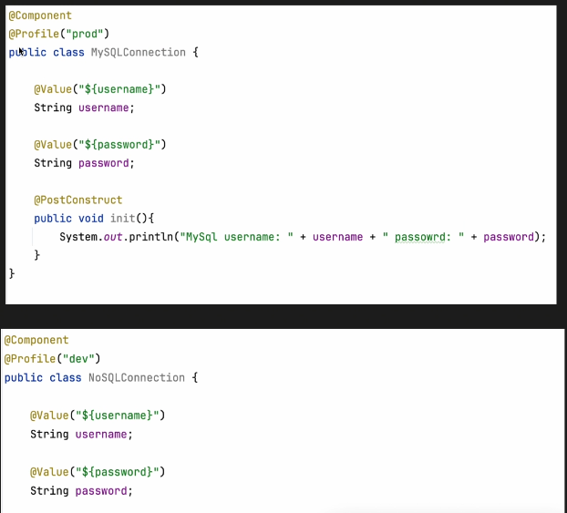

Spring will make sure `MySQLConnection` is loaded into context only when `prod` profile is active, else `NoSQLConnection` if `dev` profile is active

---

### `@Transactional`
This helps in handling DB transactions to follow ACID props.

First point cut expression `@Transaction is hit`
Then advise is to run the interceptor
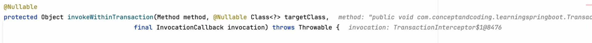

Then if exception happens we rollback else we commit

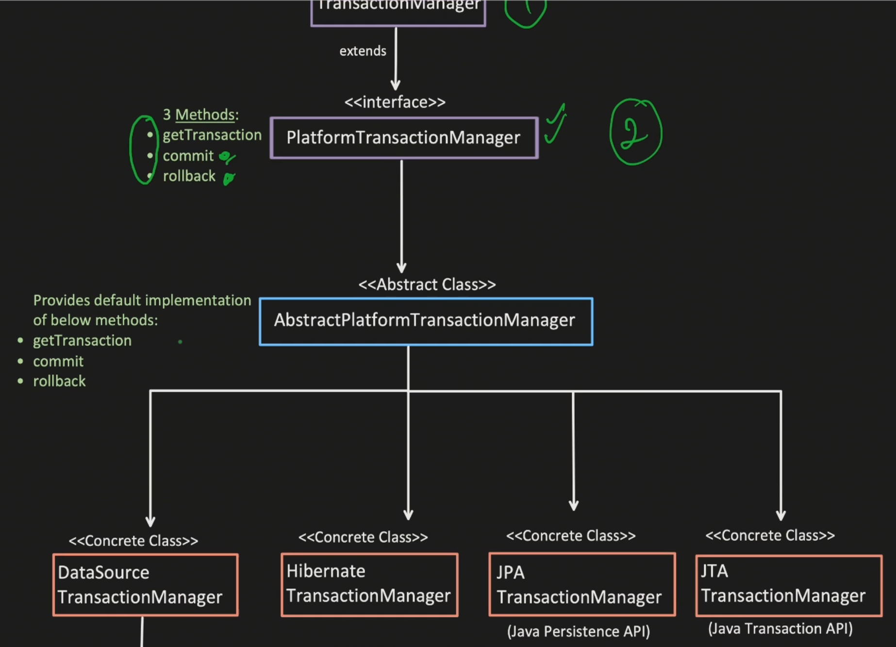

#### Declarative `@Transactional`
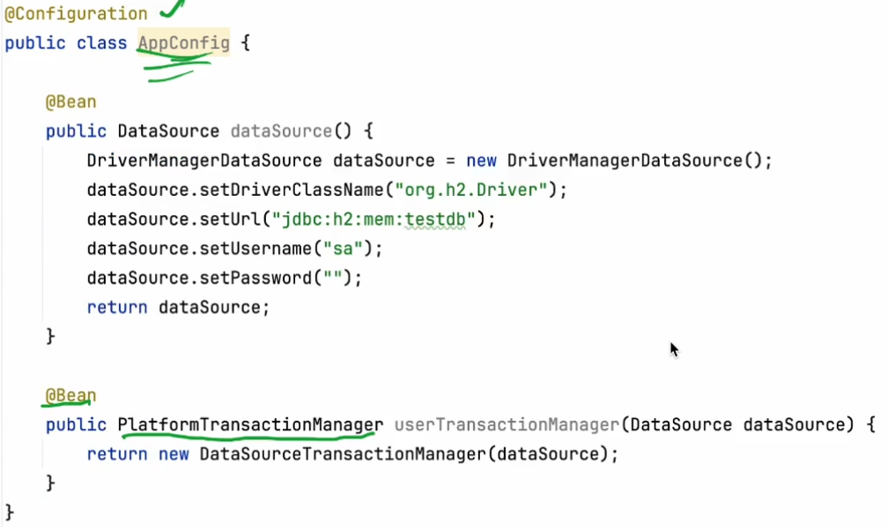
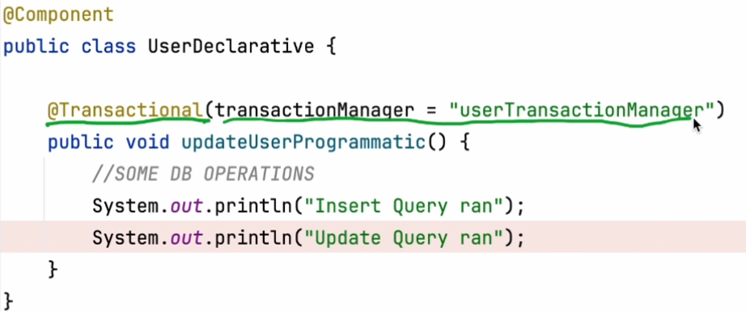

#### Programatic `@Transactional`
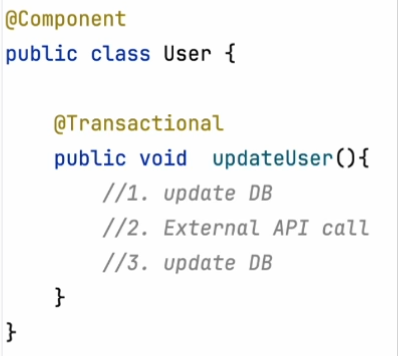

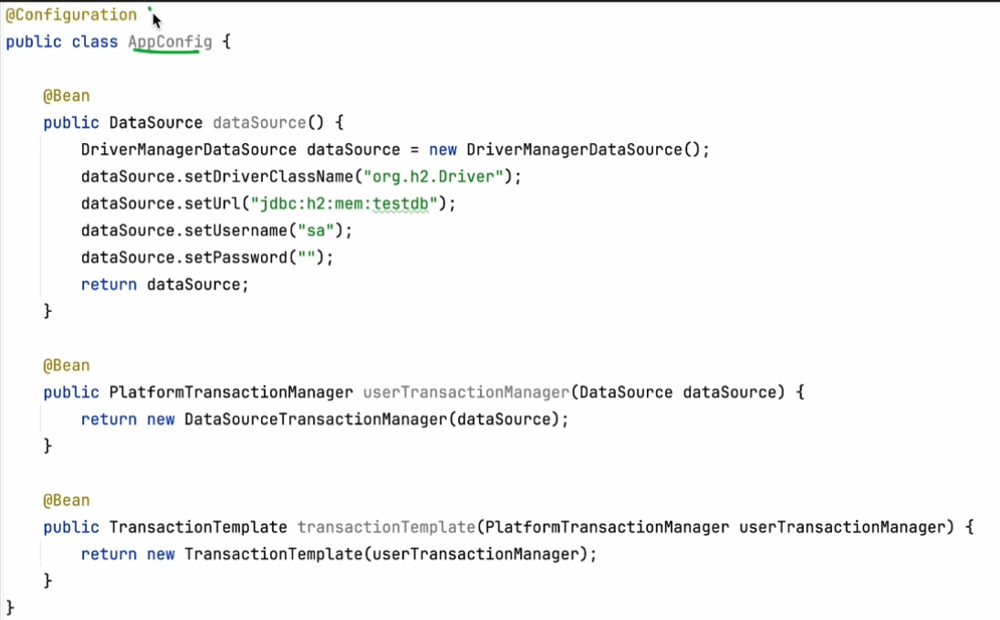

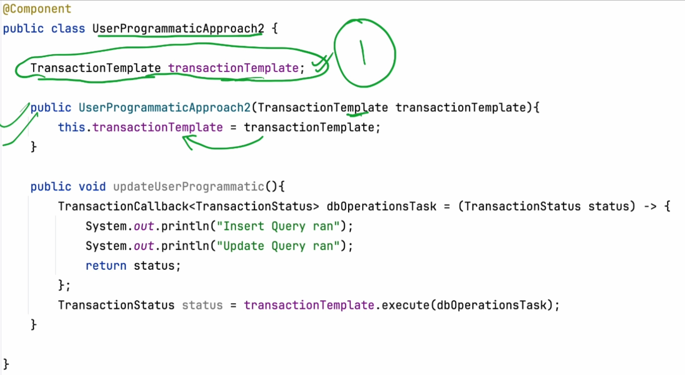

#### Transaction propogation
`@Transactional(propogation=Propogation.REQUIRED)`

`@Transactional(propogation=Propogation.REQUIRED)`

`@Transactional(propogation=Propogation.SUPPORTS)`

`@Transactional(propogation=Propogation.NOT_SUPPORTED)`

`@Transactional(propogation=Propogation.MANDATORY)`

`@Transactional(propogation=Propogation.NEVER)`

Programatic way of setting popogation
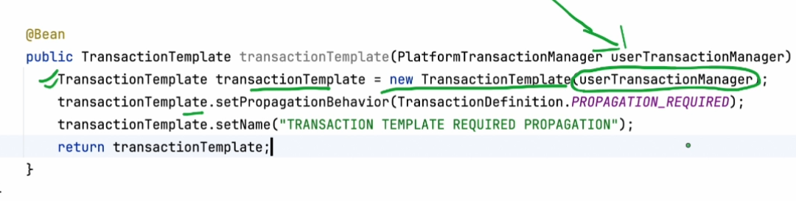

#### Isolation
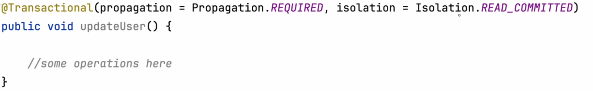

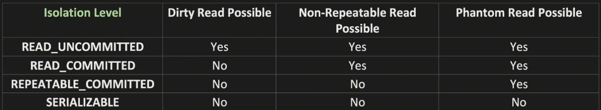

Isolation is also achieved using Shared Lock and Exclusive Locks on DB

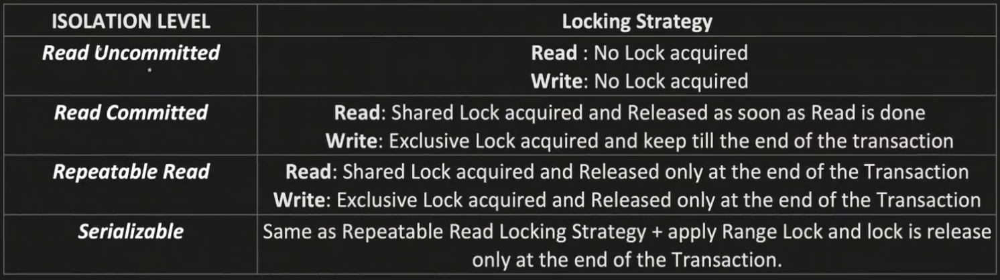
