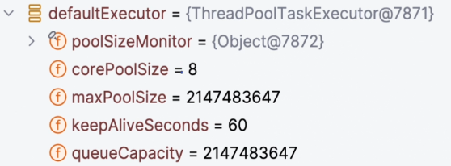
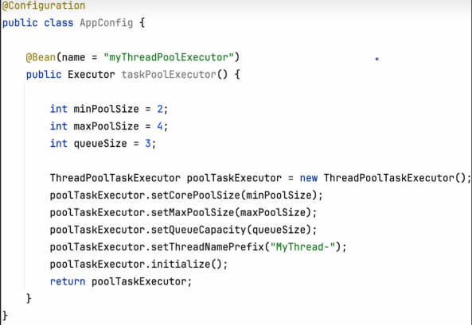
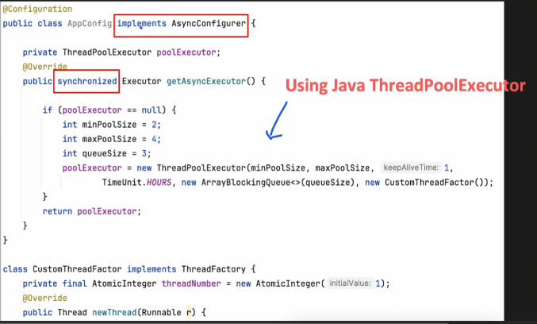
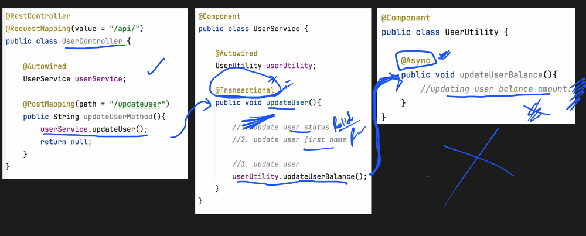
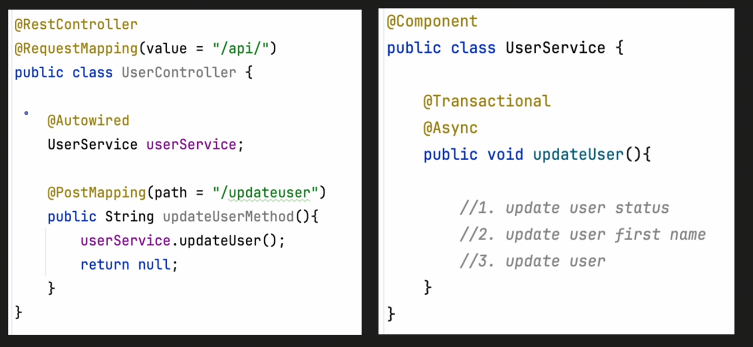
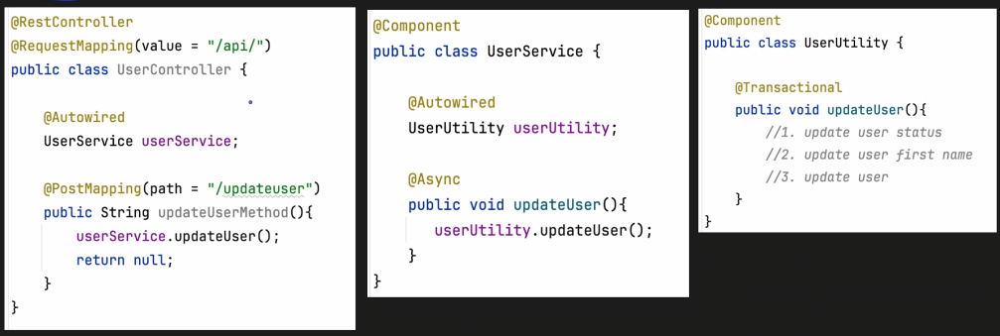
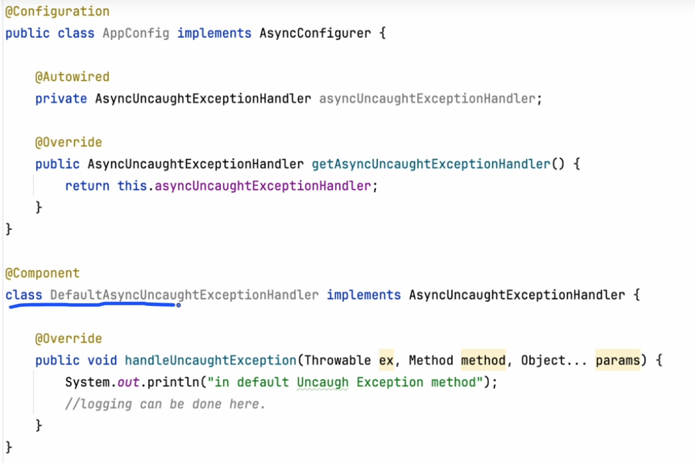

# Multithreading

Max pool size
Min Pool size
Max Queue Size

First we need to put @EnableAsync on the SpringBootApplication

Spring boot checks for default execute if not there it will use SimpleAsyncTaskExecutor

Spring boot creates its own defaultExecutor:

To configure a custom ThreadPoolTaskExecutor:

You can give a Java ThreadPoolExecutor but need to specify that inside `@Async(_HERE_)`

In case you want to use the same executor always we can do this:

To use Async we need to make sure of 2 things:
1. The Async method is supposed to be in different class
2. and the method needs to be public since AOP works that way

## @Async with @Transactional
### Use case 1 to be avoided

The transactional context is not carried over to the async. The async call failure does not get rolled back in case of failure

### Use case 2 to be used with caution

Here there is an issue where the async will create a thread and have a transaction, but the propogation might not work as expected

### Use case 3 industry standard

## @Async exception handling for a void call

Create a `@Component` that implements AsyncUncaughtExceptionHandled

