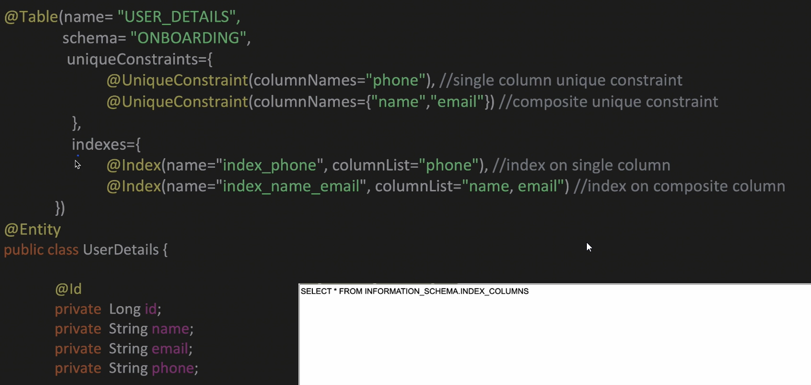

# JPA

## JDBC and SpringBoot
JDBC privodes an interface to:
- make connection with DB
- Query DB
- and process the result

When using JDBC with spring boot we can see:

1. Driver class loading: This happens in application startup time in DriverManager.class
2. JDBC Template takes care of creating DB connections and pool of connection (Hikari CP).
3. JdbcTemplate gives granular exceptions such as timeout, duplicatekey etc
4. The template takes care of closing and returning the connection to the pool
5. We can configure the connection pool in the application.pops file
   
6. If we want to use custom datasource and not hikari:
   

Different JdbcTemplate methods:
1. `update(String sqlQuery, Object ... args)` -> insert, update or delete row
2. `update(String sqlQuery, (PreparedStatement ps) -> {ps.setString(1, "asdf"); ps.setInt(2, 1234)})` -> insert, update or delete row
3. `query(String sqlQuery, (ResultSet rs, int rowNum) -> {User user = new User(); user.setName(rs.getString("user_name")})` -> get multi rows of one column
4. `queryForList(String sqlQuery, Class<T> elementType)` -> get multi rows of one column
5. `queryForObject(String sqlQuery, Object[] args, Class<T> requiredType)` -> Get single row into an object
6. `queryForObject(String sqlQuery, Class<T> requiredType)` -> Get single value Like count etc.

## JPA and SpringBoot

1. Persistence unit: the app prop file in case of spring boot. Logical grouping of EntityClasses of the same configuration
2. EntitymanagerFactory: This creates a factory for each persistence unit. If we want to manually create a factory we can do so below:
   
   
3. TransactionManager: Based on the transaction type RESOURCE_LOCAL/JTA a transaction manager is created
4. EntityManager: Its an interface in JPA that provides methods to perform CRUD operations.
5. PersistentContext: Acts as a first level cache for entitites:
   

### ORM (Object Relational Mapping):
- Acts as a bridge between Java objects and database tables
- unlike JDBC, where we have to work with SQL, we can work
#### Prereq

#### Mapping Table to Entity

### JPA Annotations for mapping table to entity
#### `@Table`

#### `@Column`

#### `@Id`
These are seen in previous example. Note that this can be done only to one field.

#### `@GeneratedValue`

We can have strategy as IDENTITY or SEQUENCE. Sequence has its own advantages:
1. Separate from table
2. Generation type table is not used in industry. It creates a new table to manage what id to generate for what table using an atomic counter.

#### `@SequenceGenerator`
sequenceName specifies the sequence created in the DB. 

#### Composite key

Using @IdClass:

Using @Embeddable:

### JPA Annotations for OneToOne